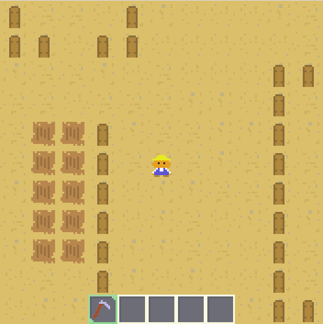

# Farming sim

This is just an experiment that emulates a farming simulator.

For now it is mostly the basics of a top-down game, but the farming mechanics have not been implemented yet.

It uses [PixelEngine](https://github.com/Orasund/pixelengine/) for rendering, input handling and the general game flow.

## Controls

- Movement: W, A, S, D
- Action: Mouse Click near the player
- Switch tool: Q, E
